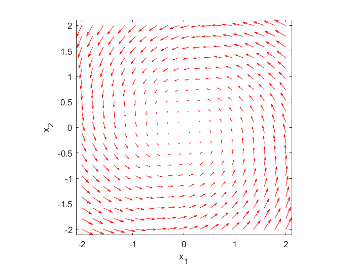

# Plot-Phase-Portraits-and-State-Space-Trajectories-of-Dynamical-Systems-in-MATLAB

In this tutorial, we explain how to generate phase portraits and state-space trajectories of dynamical systems in MATLAB. For example, consider the system 

$$
\begin{equation}
x=x
\end{equation}
$$

