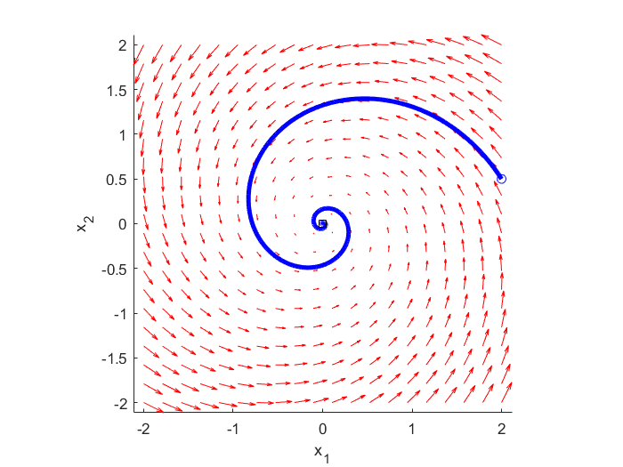

# Plot-Phase-Portraits-and-State-Space-Trajectories-of-Dynamical-Systems-in-MATLAB

In this tutorial, we explain how to generate phase portraits and state-space trajectories of dynamical systems in MATLAB. A detailed post explaining these codes is given here: https://aleksandarhaber.com/phase-portraits-and-state-space-trajectories-of-dynamical-systems-in-matlab/

The YouTube video tutorial explaining the codes is given here
https://www.youtube.com/watch?v=OnY-C-rjXUM

Included files:

- "dynamics.m" - defines the system dynamics (state-space model, see the equation below for example)
- "phase_portrait.m" - file used to plot the phase portrait, this file calls the function "dynamics.m"
- "main_file.m" - this is the main file, you should start from this file. This file calls the function "phase_portrait.m" and it provides a handle to the function "dynamics.m" to the file "phase_portrait.m". This file also simulates and plots a trajectory defined for a specified initial condition.


For example, consider the following dynamical system: 

```math
\begin{align}
\dot{x}_{1} =-x_{1}-3x_{2} \\
\dot{x}_{2} = 3x_{1} -x_{2}
\end{align}
```

In this tutorial, you will learn how to generate a phase portrait of this system. The phase portrait and state trajectories generated by using the provided codes, are shown in the figure below.



